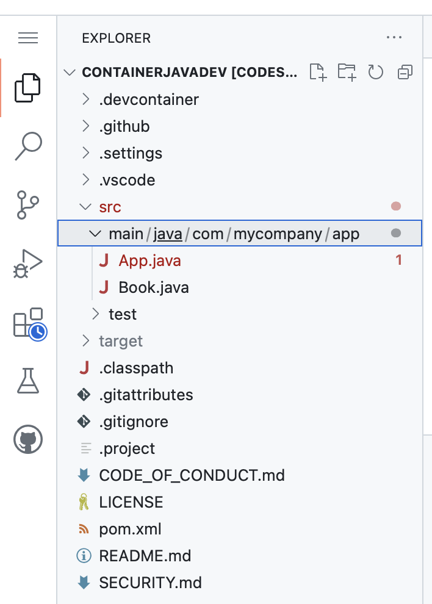

# Code directory:
Packages: Use to group related classes.
"Think of it as a folder in a file directory"

e.g folder "main/java/com/mycompany/app" inside folder "src"

Class: Built-in class And user-defined class

e.g
```
package com.mycompany.app;

//Import the whole class belong to the package of com.mycompay.app
import com.mycompany.app.*;

//Import built-in classes
import java.util.Date;
import java.lang.Math;

//import user-built specific classes
import Book;
import Student;
import Time;
import Recursion;
import List;
//detail link to class
import com.mycompany.app.InnerClass;//the same import InnnerClass
import com.mycompany.app.Person; // the same import Person

```


```
package com.mycompany.app;
```

## Directory


### 1. Main
   ```
    App.java
   ```
### 2. Classes

   ```

    Book.java

```

Notes: all pieace of codes should be written as classes in src folder under com.mycompany.app
Main () is in App.java

### 3. Some code to try


```
1 public class Student {
2      String Name;
3      String StudentID;
4      int Mark;
5      Student() { }	; // default constructor
6      public String Student(String Name, String StudentID, int Mark) {
7      this.Name = Name;
8      this.StudentID = StudentID;
9      this.Mark = Mark;

10     return StudentID;

11    }
  
  }
```
#### 3.1 Constructor

Constructor : A default constructor has no arguments (but still has the same name as the class).

```
Student() { }	;
```
#### 3.2 This

this: The this keyword refers to the current object in a method or constructor.
```
7      this.Name = Name;
8      this.StudentID = StudentID;
9      this.Mark = Mark;

```
<span style="color:red">**this**</span> refer to the 2, 3, and 4 not 6

#### 3.3 Class inside Class : inner class
```

//Java Inner classes
// Class doSomething inside HelloWorld
class InnerClasses {
    public static void main(String[] args) {
        
        InnerClasses test = new InnerClasses();//class
        InnerClasses.doSomething test2 = test.new doSomething();
        System.out.println(test2.i + " "+ test2.s);
        InnerClasses.Flower test3 = test.new Flower("hi",47);
        System.out.println(test3.s+ " " +test3.petalCount);
    }

class doSomething{
        int i =13;
        String s = "hello world";
      
    }
class Flower{
    int petalCount = 0;
    String s = new String("null");
    Flower(){}
    Flower(int petals){ petalCount = petals;}
    Flower(String ss){ s = ss;}
    Flower(String s, int petals){
        this.s = s;
        this.petalCount = petals;
        
    }
    
}
}

```

#### 3.4 Get and Set


Encapsulation: to make sure that "sensitive" data is hidden from users. 
To achieve, must: 
+ declare class variables/attributes as private
+ provide public get and set methods to access and update the value of a private variable

##### Example 1
```
public class Person {
  
        private String name;
        Person(){}
        
        public String getName(){
            return name;
        }
        public void setName(String name){
            this.name = name;
            
        }
      
    
}
```
Test / call Get and Set
```
public static void main(String[] args){
        Person per = new Person();
        per.setName("ABC");
        System.out.println(per.getName());
        //output is ABC

}
```
##### Example 2
```
1 public class Time {
2   int hour;
3  // int minute;
4  // int second;

5  //Constructor
6  Time() { setTime(0);} // default constructor
7  Time(int h){setTime(h);}

8  Time setTime(int h) {
9    setHour(h);   // Set sets the value
10    return this; // return value
11  }

12  Time setHour(int h) {
13    hour = ((h >= 0 && h < 24) ? h : 0);
14    return this;
15  }

16  int getHour(){return hour}; // Get returns the variable value

17  public int stringToScreen() {
18    return hour;
19  }

20}


```
#### 3.5 Recursion
```
//Factorial n!=n(n-1)(n-2)...x3x2x1
public class Recursion {
  int num;

  // Constructor
  Recursion() {
  } // default constructor- remember ; before }

  Recursion(int number) {
  } // constructor for int

  public int Recursion(int number) {
    num = number;
    if (num <= 1) // base case
      return 1;
    else
      return num * Recursion(num - 1);
  }

}


```
Test/Call recursion
```
public static void main(String [] args){

        Recursion myFactorial = new Recursion(3);
        System.out.println(myFactorial);
}        
```
#### 3.6 Array of Objects
##### Syntax

1. Create using Object class
```
Class_Name [] objArrRef;
OR
Class_Name objArrRef[];
```
2. Instantiate the array of Objects
```
Class_Name obj[] = new Class_Name[array_length];
OR
Class_Name [] obj = new Class_Name[array_length];
```
3. Call /Test
```
obj[0] = new Class_Name(para1_val, para2_val, para_n_val);
obj[1] = new Class_Name(para1_val, para2_val, para_n_val);
```

##### Example

```
public class NameNumber {} //A class

private NameNumber[] nnArray = new NameNumber[100];//array of Object class

//Call or test

//Instantiate the array of Object
     
        nnArray[0] = new NameNumber("John Doe", "0919191919");
        nnArray[1] = new NameNumber("John Doe", "919");
        String lastName = nnArray[0].getLastName();
        String number = nnArray[0].getTelNumber();

        NNCollection nnC = new NNCollection();
        nnC.insert(nn[0]); 
        nnC.insert(nn[1]); 
        String numFind = nnC.findNumber(lastName);

```


# Bug
```


```
## Git bug
Commit before pulling the updated code

Avoid:
```
git pull --ff-only
```
 --ff: “fast-forwarded” without creating new commits.

```
git reset
``` 

# Note
## Comment block
Shift + Option + A
## Arrange code
Option + Shift + F : arrange code

# Try Out Development Containers: Java

[](https://vscode.dev/redirect?url=vscode://ms-vscode-remote.remote-containers/cloneInVolume?url=https://github.com/microsoft/vscode-remote-try-java)

A **development container** is a running container with a well-defined tool/runtime stack and its prerequisites. You can try out development containers with **[GitHub Codespaces](https://github.com/features/codespaces)** or **[Visual Studio Code Dev Containers](https://aka.ms/vscode-remote/containers)**.

This is a sample project that lets you try out either option in a few easy steps. We have a variety of other [vscode-remote-try-*](https://github.com/search?q=org%3Amicrosoft+vscode-remote-try-&type=Repositories) sample projects, too.

> **Note:** If you already have a Codespace or dev container, you can jump to the [Things to try](#things-to-try) section.

## Setting up the development container

### GitHub Codespaces
Follow these steps to open this sample in a Codespace:
1. Click the **Code** drop-down menu.
2. Click on the **Codespaces** tab.
3. Click **Create codespace on main**.

For more info, check out the [GitHub documentation](https://docs.github.com/en/free-pro-team@latest/github/developing-online-with-codespaces/creating-a-codespace#creating-a-codespace).

### VS Code Dev Containers

If you already have VS Code and Docker installed, you can click the badge above or [here](https://vscode.dev/redirect?url=vscode://ms-vscode-remote.remote-containers/cloneInVolume?url=https://github.com/microsoft/vscode-remote-try-java) to get started. Clicking these links will cause VS Code to automatically install the Dev Containers extension if needed, clone the source code into a container volume, and spin up a dev container for use.

Follow these steps to open this sample in a container using the VS Code Dev Containers extension:

1. If this is your first time using a development container, please ensure your system meets the pre-reqs (i.e. have Docker installed) in the [getting started steps](https://aka.ms/vscode-remote/containers/getting-started).

2. To use this repository, you can either open the repository in an isolated Docker volume:

    - Press <kbd>F1</kbd> and select the **Dev Containers: Try a Sample...** command.
    - Choose the "Java" sample, wait for the container to start, and try things out!
        > **Note:** Under the hood, this will use the **Dev Containers: Clone Repository in Container Volume...** command to clone the source code in a Docker volume instead of the local filesystem. [Volumes](https://docs.docker.com/storage/volumes/) are the preferred mechanism for persisting container data.

   Or open a locally cloned copy of the code:

   - Clone this repository to your local filesystem.
   - Press <kbd>F1</kbd> and select the **Dev Containers: Open Folder in Container...** command.
   - Select the cloned copy of this folder, wait for the container to start, and try things out!

## Things to try

Once you have this sample opened, you'll be able to work with it like you would locally.

Some things to try:

1. **Edit:**
   - Open `src/main/java/com/mycompany/app/App.java`.
   - Try adding some code and check out the language features.
   - Make a spelling mistake and notice it is detected. The [Code Spell Checker](https://marketplace.visualstudio.com/items?itemName=streetsidesoftware.code-spell-checker) extension was automatically installed because it is referenced in `.devcontainer/devcontainer.json`.
   - Also notice that the [Extension Pack for Java](https://marketplace.visualstudio.com/items?itemName=vscjava.vscode-java-pack) is installed. The JDK is in the `mcr.microsoft.com/devcontainers/java` image and Dev Container settings and metadata are automatically picked up from [image labels](https://containers.dev/implementors/reference/#labels).

2. **Terminal:** Press <kbd>Ctrl</kbd>+<kbd>Shift</kbd>+<kbd>\`</kbd> and type `uname` and other Linux commands from the terminal window.

3. **Build, Run, and Debug:**
   - Open `src/main/java/com/mycompany/app/App.java`.
   - Add a breakpoint.
   - Press <kbd>F5</kbd> to launch the app in the container.
   - Once the breakpoint is hit, try hovering over variables, examining locals, and more.

4. **Run a Test:**
   - Open `src/test/java/com/mycompany/app/AppTest.java`.
   - Put a breakpoint in a test.
   - Click the `Debug Test` in the Code Lens above the function and watch it hit the breakpoint.

5. **Install Node.js using a Dev Container Feature:**
   - Press <kbd>F1</kbd> and select the **Dev Containers: Configure Container Features...** or **Codespaces: Configure Container Features...** command.
   - Type "node" in the text box at the top.
   - Check the check box next to "Node.js (via nvm) and yarn" (published by devcontainers) 
   - Click OK
   - Press <kbd>F1</kbd> and select the **Dev Containers: Rebuild Container** or **Codespaces: Rebuild Container** command so the modifications are picked up.

  
## Contributing

This project welcomes contributions and suggestions. Most contributions require you to agree to a
Contributor License Agreement (CLA) declaring that you have the right to, and actually do, grant us
the rights to use your contribution. For details, visit https://cla.microsoft.com.

When you submit a pull request, a CLA-bot will automatically determine whether you need to provide
a CLA and decorate the PR appropriately (e.g., label, comment). Simply follow the instructions
provided by the bot. You will only need to do this once across all repos using our CLA.

This project has adopted the [Microsoft Open Source Code of Conduct](https://opensource.microsoft.com/codeofconduct/).
For more information see the [Code of Conduct FAQ](https://opensource.microsoft.com/codeofconduct/faq/) or
contact [opencode@microsoft.com](mailto:opencode@microsoft.com) with any additional questions or comments.

## License

Copyright © Microsoft Corporation All rights reserved.<br />
Licensed under the MIT License. See LICENSE in the project root for license information.
